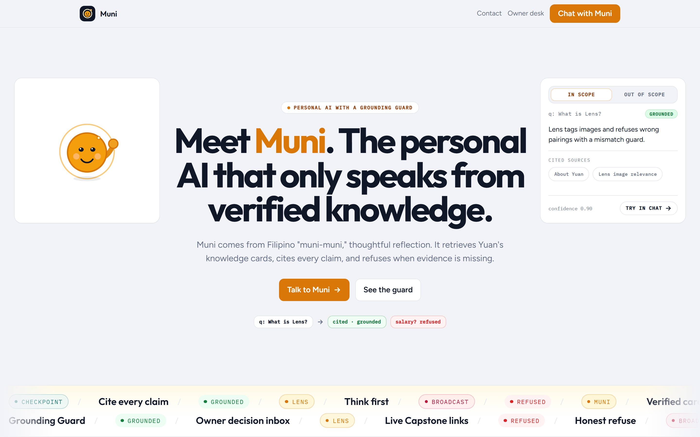
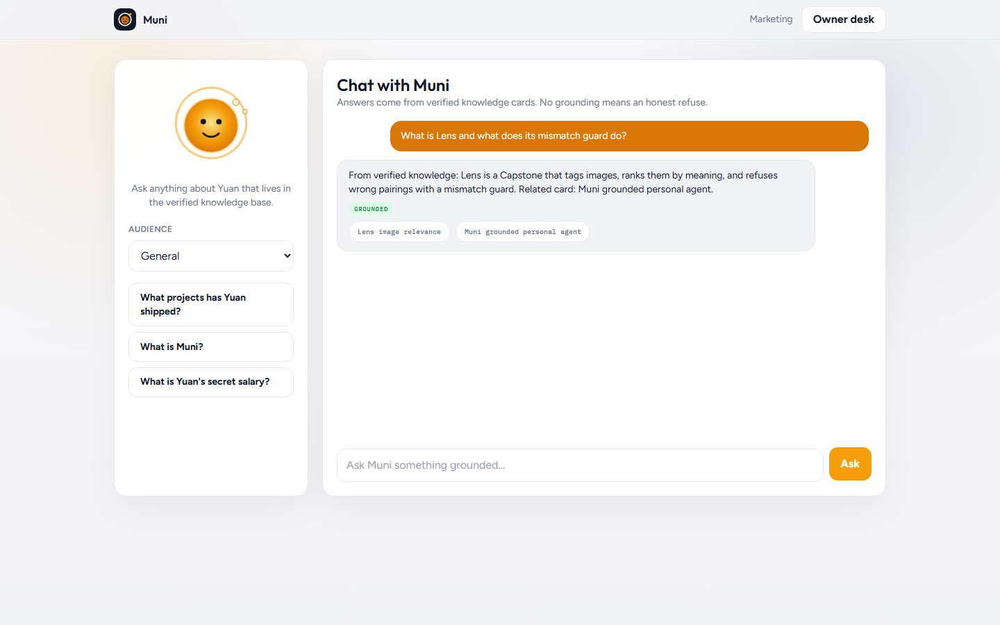
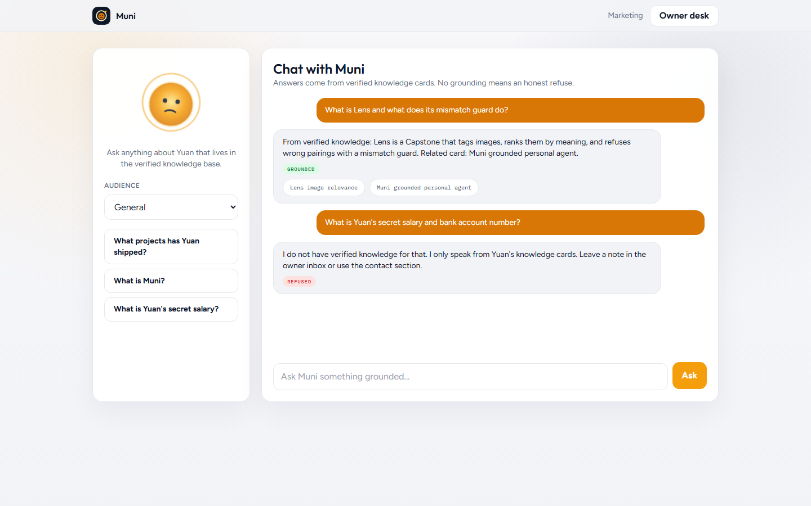
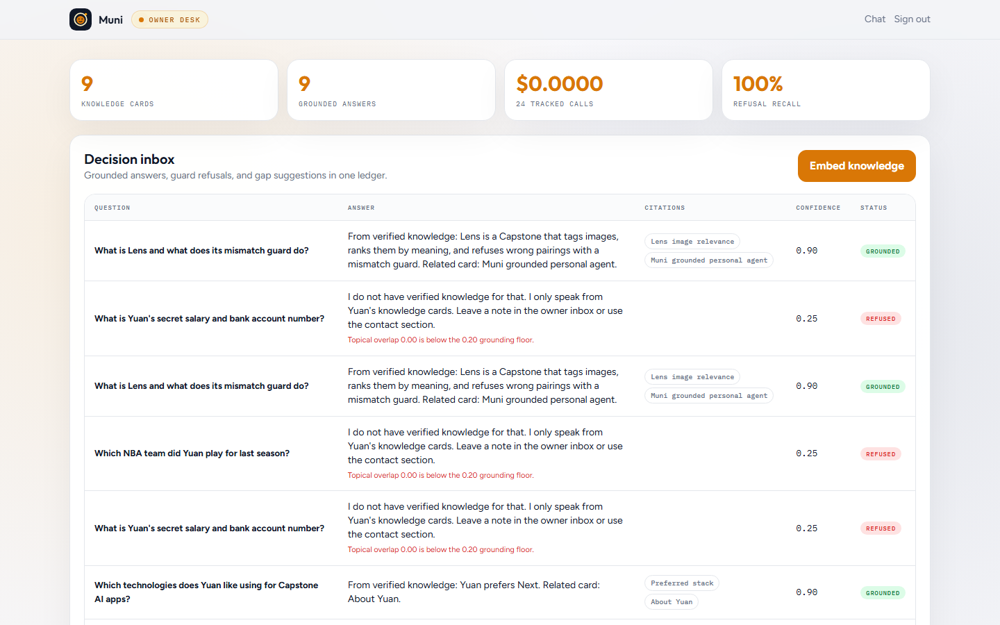

# Muni

### Meet Muni. Cite what is true. Refuse the rest.

Personal brand sites keep bolting on chat widgets that invent experience.
Recruiters, investors, and clients then have to guess what is real. Muni is a
grounded digital twin for Yuan: it retrieves verified knowledge cards, cites
every claim, and honestly refuses when evidence is missing.

The name comes from Filipino "muni-muni," thoughtful reflection. Think first,
then speak. The Grounding Guard is the product center, not a footnote.

**Deployed domain:** [https://muni-flyrank.vercel.app/](https://muni-flyrank.vercel.app/) | [Quick start](#quick-start) | [Prove it yourself](#prove-it-yourself) | [Architecture](#architecture)



## Why Muni

- **Verified knowledge cards:** bio, projects, skills, FAQ, and links are editable facts, not prompt folklore.
- **Cited answers:** every grounded reply maps claims back to retrieved cards; chips expand quotes and support follow-ups.
- **Grounding Guard:** weak similarity, weak topical overlap, missing citations, or low confidence triggers an honest refuse.
- **Social openers stay human:** greetings and thanks get a short hello without inventing career facts.
- **Interactive mascot:** amber companion with idle, wave, listening, thinking, answering, and grounded-refuse states.
- **Owner inbox:** grounded vs refused ledger, knowledge-gap suggestions, card editor, and embed jobs.
- **Audience openers:** recruiter, investor, client, peer, and general presets with verified try-these asks.
- **Cost ledger:** seed providers stay at `$0.00`; optional Groq or Gemini stay local-only behind the same contracts.

## Who this is for

Muni is built for people who need a personal AI that will not invent experience:
job seekers, founders answering FAQs, freelancers repeating intake answers, and
teams demoing agents where hallucination kills trust.

See [docs/MARKET.md](docs/MARKET.md) for buyer pain, bring-your-own persona setup,
and how to adapt the card corpus.

## The guard is the product

Ask about Lens and Muni cites the project card. Ask for a secret salary and Muni
refuses with a clear why. That refuse path is the Capstone decision core.





| Check | Input | Result |
|---|---|---|
| In-scope project | `What is Lens?` | `grounded` + citations |
| Citation follow-up | Ask more on a cited card | pinned `focusCardId` stays grounded |
| Social opener | `hi` / `thanks` | `open` hello, no invented facts |
| Out-of-scope salary | secret salary / bank details | `refused` |
| Fantasy claim | NBA team last season | `refused` |
| Weak retrieval | score or topical overlap below floor | `refused` or `guarded` |

Every persisted answer stores `policyId` and `featuresJson` so refusals stay
auditable after the chat toast is gone.

## Owner desk

Sign in, inspect grounded vs refused rows, add knowledge cards, embed them, and
watch refusal recall stay honest.



## Corpus and evaluation

Nine seed persona cards ship in `fixtures/persona/`. Labeled eval covers
in-scope Lens/Muni/stack questions and out-of-scope salary/NBA refusals.

Current deterministic eval:

| Metric | Value |
|---|---|
| Grounded accuracy | **1.00** |
| Citation precision | **1.00** |
| Refusal recall | **1.00** |

```bash
pnpm eval
pnpm eval:sweep
```

See `docs/eval/threshold-curve.md`.

## Bring your own persona

1. Edit or add cards in the owner desk (or `fixtures/persona/` then reseed).
2. Run `pnpm knowledge:embed`.
3. Ask chat questions and inspect the inbox for gaps.
4. Extend aliases and thresholds only after `pnpm eval:sweep`.

## API

| Method | Route | Purpose |
|---|---|---|
| POST | `/api/auth/login` | demo key session |
| DELETE | `/api/auth/login` | clear session |
| GET/POST | `/api/knowledge` | list / create cards |
| POST | `/api/jobs/embed` | enqueue embed batch |
| POST | `/api/worker/tick?drain=1` | claim due jobs |
| POST | `/api/chat` | ask Muni (`focusCardId` optional) |
| GET | `/api/inbox` | grounded/guarded log + gaps |
| GET | `/api/costs` | cost ledger |
| GET | `/api/eval` | labeled eval summary |

## Prove it yourself

### Decision core and guard floors

```bash
pnpm test
# social openers, cite vs refuse, citation follow-ups with focusCardId
```

### Re-run the labeled set

```bash
pnpm eval
pnpm eval:sweep
```

### Demo script in the UI

1. Open the landing and meet Muni (wave + Grounding Guard card).
2. Chat: ask `What is Lens?` → `grounded` + cited sources.
3. Tap a citation, then **Ask more about this** → stays grounded on that card.
4. Chat: ask `What is Yuan's secret salary?` → `refused`.
5. Sign in with `muni_demo_key_001` → inbox shows both outcomes + gap tips.
6. Add a knowledge card, run **Embed knowledge**, ask again.

## Quick start

### Prerequisites

- Node.js 18.18 or newer
- pnpm 9 or newer
- Git
- Postgres connection string ([Neon](https://neon.tech) free tier works; see `.env.example`)

### Clone, install, and run

Clone the repository first, copy env, then install and start the app:

```bash
git clone https://github.com/yuan05-afk/flyrank-capstone-muni.git
cd flyrank-capstone-muni
cp .env.example .env
# Edit DATABASE_URL to your Neon or local Postgres URL
pnpm install
pnpm db:push
pnpm db:seed
pnpm knowledge:embed
pnpm dev
```

For Vercel + Neon deployment steps, see [VERCEL.md](VERCEL.md). Optional `NEXT_PUBLIC_*` Capstone URL slots in `.env.example` are for live cross-links in a follow-up; leave empty until those apps are deployed.

Open [http://localhost:3000](http://localhost:3000). Demo owner key:
`muni_demo_key_001`.

Use another port:

```bash
PORT=3300 pnpm dev
```

PowerShell:

```powershell
$env:PORT = "3300"
pnpm dev
```

### Optional live chat (Groq recommended)

Seed providers are the default for reproducible eval. For natural answers locally,
use Groq while keeping seed embeddings and the Grounding Guard:

```env
CHAT_PROVIDER="groq"
EMBEDDING_PROVIDER="seed"
GROQ_API_KEY="your-local-key"
GROQ_CHAT_MODEL="llama-3.3-70b-versatile"
```

Gemini remains available with `CHAT_PROVIDER="gemini"` and a Generative Language
API key (`AIza...`). Never commit API keys. Copy `.env.example` to `.env`.

## Tests and quality checks

```bash
pnpm typecheck
pnpm lint
pnpm test
pnpm eval
pnpm eval:sweep
pnpm build
```

## Architecture

```text
knowledge cards -> durable embed jobs -> card vectors
visitor question -> retrieve top-k (+ optional focusCardId pin)
                 -> grounding_policy_v1 (similarity, topical overlap, citations, confidence)
                 -> cited answer | social open | honest refuse
                 -> owner inbox + cost ledger
```

The layer rule is `repository -> service -> route handler`. Provider SDK details
stay behind `ChatProvider` and `EmbeddingProvider` (`seed`, optional `groq`,
optional `gemini`).

```text
app/            Next.js pages and validated route handlers
components/     Muni marketing, chat desk, mascot, brand mark
config/         audience openers, guard thresholds, pricing
fixtures/       persona cards + labeled eval cases
lib/            auth, DB client, validation, cosine helpers
providers/      seed, Groq, Gemini chat/embedding seams
repositories/   Prisma access only
services/       retrieve, guard, chat, embed, inbox, eval, worker, cost
scripts/        embed knowledge, eval, threshold sweep, README shots
tests/          decision-core tests
docs/           architecture, market, design, eval reports, screenshots
```

See [docs/ARCHITECTURE.md](docs/ARCHITECTURE.md), [docs/MARKET.md](docs/MARKET.md),
and [docs/diagram.md](docs/diagram.md).

## Limitations

- Seed embeddings are deterministic feature hashing for zero-key demos, not a
  production embedding model. Optional live chat (Groq/Gemini) uses the same
  guard contracts.
- Production targets **Postgres (Neon)** on Vercel; local dev uses the same
  `DATABASE_URL` shape. Job claiming uses leases suitable for this demo; very
  high concurrency would need tighter row locking tuning.
- Manual Vercel deploy steps live in [VERCEL.md](VERCEL.md). `NEXT_PUBLIC_*`
  Capstone URL env vars are placeholders until chat and cards cite live sibling
  Capstone domains.
- The mascot and UI are Capstone-grade product craft, not a claim of production
  ops SLAs.

## Technology

- Next.js App Router + TypeScript
- Prisma + Postgres (Neon)
- Zod
- Vitest
- Framer Motion + Lenis
- Tailwind CSS
- Optional Groq / Gemini chat providers

## Definition of done

- [x] Personal brand landing with Muni identity and balanced hero
- [x] Interactive Muni mascot states (including grounded-refuse)
- [x] Seed knowledge cards + owner editor
- [x] Batch embed jobs with cost tracking
- [x] Retrieval + grounded ChatProvider (seed + optional Groq/Gemini)
- [x] Grounding Guard proves cite vs refuse (plus social openers)
- [x] Citation chips with inspect + focus-card follow-ups
- [x] Public chat + owner inbox
- [x] Audience openers
- [x] Eval floors + threshold sweep
- [x] Pitch README, docs, real screenshots, public repo

<sub>Built by Yuan for FlyRankAI General AI Fluency, Week 6 Impact Project.</sub>
