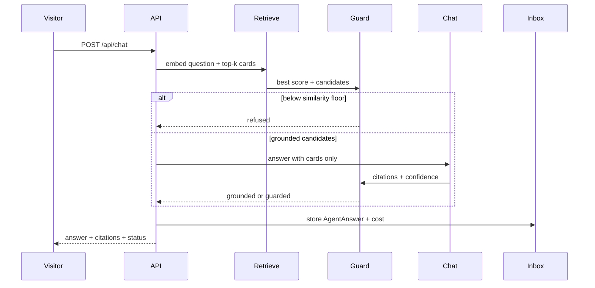

# Muni flow

```mermaid
sequenceDiagram
  participant Visitor
  participant API
  participant Retrieve
  participant Guard
  participant Chat
  participant Inbox

  Visitor->>API: POST /api/chat
  API->>Retrieve: embed question + top-k cards
  Retrieve->>Guard: best score + candidates
  alt below similarity floor
    Guard-->>API: refused
  else grounded candidates
    API->>Chat: answer with cards only
    Chat->>Guard: citations + confidence
    Guard-->>API: grounded or guarded
  end
  API->>Inbox: store AgentAnswer + cost
  API-->>Visitor: answer + citations + status
```
